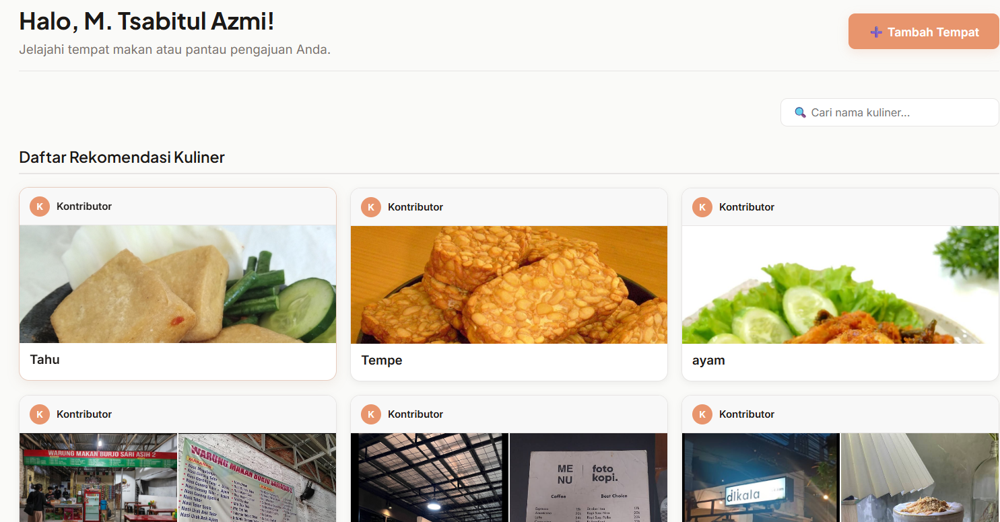
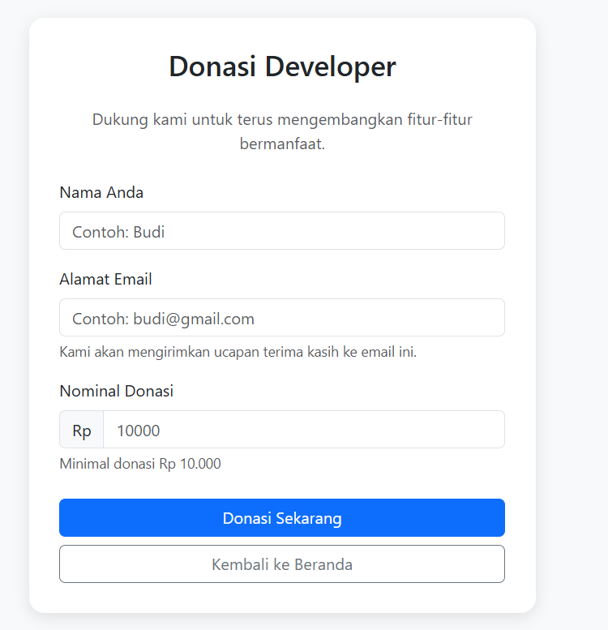
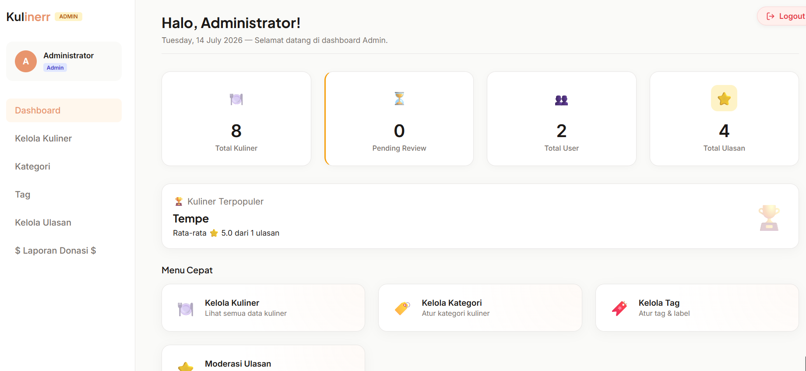

# Proyek Aplikasi Kuliner


Aplikasi web berbasis CodeIgniter 4 untuk pengelolaan data kuliner dan fitur donasi.

## Fitur Utama
- **Manajemen Data Kuliner**: CRUD (Create, Read, Update, Delete) informasi tempat dan menu kuliner.
- **Sistem Donasi (Payment Gateway)**: Integrasi dengan API Midtrans untuk memudahkan proses pembayaran dan donasi.
- **Manajemen Kategori & Tag**: Pengelompokan kuliner berdasarkan kategori dan tag yang relevan.
- **Manajemen Role User**: Akses terpisah antara Admin (pengelola penuh) dan Kontributor/User (donatur & reviewer).
- **Review & Rating**: Pengguna dapat memberikan ulasan atau komentar pada tempat kuliner.

## Teknologi yang Digunakan
- **Backend**: PHP 8.2, Framework CodeIgniter 4
- **Database**: MySQL
- **Payment Gateway**: Midtrans (Payment Gateway Indonesia)
- **Frontend**: HTML, CSS, JavaScript (Bootstrap/Tailwind)

## Persyaratan Sistem
- PHP 8.2 atau lebih baru
- MySQL
- Composer

## Cara Instalasi

1. **Clone repository ini**
   ```bash
   git clone <URL_REPOSITORY_ANDA>
   cd projectpwl22
   ```

2. **Install dependensi menggunakan Composer**
   ```bash
   composer install
   ```

3. **Konfigurasi Environment (.env)**
   - Copy file `.env.example` dan ubah namanya menjadi `.env`
   - Buka file `.env` dan sesuaikan konfigurasi database, API Key, Midtrans, dan SMTP Email Anda. (Lihat panduan di bawah).

4. **Jalankan Migrasi dan Seeder**
   Pastikan Anda sudah membuat database di MySQL (misal: `db_kuliner`), lalu jalankan perintah ini untuk membuat tabel dan mengisi data awal:
   ```bash
   php spark migrate --seed
   ```

5. **Jalankan Server Lokal**
   ```bash
   php spark serve
   ```
   Aplikasi dapat diakses di `http://localhost:8080`

## Konfigurasi .env

Pastikan Anda mengubah beberapa baris berikut di file `.env` Anda:

```env
# URL Base
app.baseURL = 'http://localhost:8080/'

# Konfigurasi Database
database.default.hostname = localhost
database.default.database = db_kuliner
database.default.username = root
database.default.password = 

# Kunci API untuk webservice
MY_API_KEY = my-secret-token

# Kunci Midtrans untuk fitur donasi
MIDTRANS_SERVER_KEY=Kunci-Server-Anda
MIDTRANS_CLIENT_KEY=Kunci-Client-Anda

# Konfigurasi SMTP Email
SMTP_HOST=smtp.gmail.com
SMTP_USER=email-anda@gmail.com
SMTP_PASS=password-aplikasi-email-anda
SMTP_PORT=465
```
> **Penting**: File `.env` sudah dimasukkan ke `.gitignore` sehingga data rahasia Anda tidak akan ter-push ke GitHub.

## Cara Penggunaan

1. **Akses Aplikasi**: Buka `http://localhost:8080` di browser Anda.
2. **Sebagai Admin**: Login menggunakan akun admin untuk mengakses Dashboard Admin, menambah, mengubah, atau menghapus data kuliner, kategori, dan tag.
3. **Sebagai User/Kontributor**: Login untuk melihat daftar kuliner, memberikan review, atau melakukan pembayaran donasi untuk campaign tertentu via Midtrans.

## Akun Demo

Gunakan akun berikut untuk mencoba masuk ke dalam sistem:

**Akun Admin**
- Email: `admin@kuliner.com`
- Password: `admin123`
- Role: `admin`

**Akun Kontributor / User**
- Email: `kontributor@kuliner.com`
- Password: `kontributor123`
- Role: `kontributor`

## Screenshot Fitur Utama

*(Tambahkan gambar screenshot aplikasi Anda di sini sebelum mengunggah ke GitHub)*

### 1. Halaman Utama / Daftar Kuliner


### 2. Fitur Donasi


### 3. Dashboard Admin


## Lisensi

Proyek ini dilisensikan di bawah [MIT License](LICENSE). Silakan lihat file `LICENSE` untuk informasi lebih lanjut.

## Kontak

Dibuat oleh **M.Tsabitul Azmi** - [Azmitsabitul315@gmail.com]  
Link Repositori:( https://github.com/azmitsabitul315-source/projectpwl)
